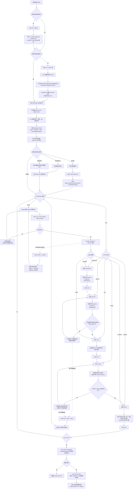

# Harness 设计

## 0. 理念与统一原则

Withy 的「约束层」核心在这里:workflow 状态机、`next` 推进门禁、文档/提示词流转、hook 注入、用户扩展点。

两条总原则:

- **所有判定都在 [@withy/core](./core.md)**,CLI 与 hook 都是 core 的调用方,不重复实现。
- 主线 agent 是 **Codex**(`skill.mode='canonical'`,适配最薄)。

基本理念:不用 Markdown 求 AI「应该怎么做」,而用结构化 workflow + 代码门禁判定「这步算不算做完」。Skill(Markdown)只答「怎么做」,harness 答「做完没」。

**统一原则(本轮重构核心)**:harness 只有一个逻辑层 = `@withy/core`,只有一个调用入口形态 = `withy` 子命令。

```text
主动事件(agent 干完活)   →  withy next               ┐
被动事件(平台会话开始)   →  withy hook <event>      ├─→ @withy/core(唯一逻辑)
查询(看注入计划)        →  withy context show       ┘
平台 hook 脚本(py/sh)   →  只转发到 withy,不含业务
```

对照旧设计:`complete` 是 TS、`session-start.py` 自己读 `.withy/`,两套实现必漂移。现在 hook 退化成声明文件里一行 `withy hook` 命令(无脚本),逻辑全回到 core。agent 面向的推进命令统一为 `withy next`:它不接收 nodeId,由 core 读取当前游标,降低 agent 传错参数的概率。

---

## 1. Workflow 模型(固定三阶段 + 节点图)

静态定义 `workflows/<id>.workflow.json`(core §4.3),`state.json` 是动态游标。结构 = **三个固定阶段**(planning / 执行 / 收尾,不可增删)+ 阶段内/阶段前的两类节点:

```text
skill 节点   单出(next),入度不限   读 skill 照做,受可选 gate 约束;做完 withy next 推进
switch 节点  单入多出(branches)     岔路口:agent 判断走哪条;走到就停,withy next --branch;必含一个 default

entry → [switch] → skill → ... → (next:null 终点)   图必须无环(返工=停留原节点重试 §2.4;判错=rewind §3.1)
```

默认 workflow:`triage(switch) →{standard:planning | small:execute | research:finish}→ ... → finish`。门禁 `gate`(artifacts/checks/approval)全部**可选**,产物按需(core §7、§4.3.1)。

**主体流程与执行步骤是两层**,phase 是**固定的有序骨架**(三个阶段),不是自由标签:

```text
主体流程(粗粒度)= 三个固定阶段   规划 → 执行 → 收尾   ← "在哪个大阶段",驱动 task.status / web 三框进度
执行步骤(细粒度)= 阶段内/前节点    triage→brainstorm→...  ← "具体哪一步",可分支、可跳整段
```

当前主体流程 = `phaseOf(currentNode)`(读节点 `phase` 字段,core §6)。三条约定:

- 阶段单调推进(validate 拒绝倒退)。
- 某些任务可经 switch **跳过整段阶段**(如 small 任务从 triage 直接进 execute,planning 整段不走)。
- 每个阶段声明一个 `entry` 入口节点(阶段外指进来只能落在它上,保证阶段单入);未绑定阶段的节点(`phase:null`)在三阶段之前,不改 task.status。

---

## 2. `withy next` 门禁

agent 面向的入口是 `withy next`,它读取当前任务的 `state.currentNode`,再调用 core 门禁。

- **skill 节点**:走 gate。
- **switch 节点**:不带 branch 时只输出合法分支与下一条命令提示;带 `--branch <label> --reason "..."` 时才推进。

`withy complete <node>` 明确删除,不保留兼容入口;测试和 web 也应调用 `nextNode` 或更小的纯函数,不能重新暴露 node 参数。

门禁扩展实例(note / progress checker、checklist 进度源、新鲜度 floor 算法)见 [[node-gate-checkers]];事件流与会话注入回填见 [[task-event-timeline]]。

### 2.1 流程

```text
core.nextNode(scope, taskId, opts?)
  读 workflow + state
  node = state.currentNode
  currentNode == null? ──是──► 已完成,输出归档提示
  switch 节点?
    ├─ 未传 opts.branch ──► exit 2:输出合法分支 + nextAction="withy next --branch <label> --reason ..."
    └─ opts.branch 是合法分支? ──否──► exit 2:"需 --branch <合法分支>"
       记 state.decisions[node]={branch,reason,by,at} + decision 事件 → 沿该分支 next 推进
  skill 节点?(有 gate 才查,全可选)
    ├─ gate.artifacts 全存在且非空? ──否──► exit 2:列缺失/空文件
    ├─ 逐条跑 gate.checks(命令,只看退出码) ─非0─► exit 2:打印失败命令+输出尾部
    └─ gate.approval 且未 approve? ──► exit 2:"需 withy approve"
       全过 → advanceWorkflow(§3,沿 next、遇下个 switch 停)
  writeState + exit 0(成功输出下一节点接力 JSON,§2.3)
```

### 2.2 参考实现(core/workflow:runtime.ts IO 壳 → interpret.ts 策略 → engine.ts 通用机)

```ts
export function nextNode(
  scope: Scope,
  taskId: string,
  opts?: { branch?: string; reason?: string; by?: string },
): NextResult {
  const wf = readWorkflow(scope, readTask(scope, taskId).workflow);
  const state = readState(scope, taskId);
  const nodeId = state.currentNode;
  if (nodeId === null) return { ok: true, exitCode: 0, next: null };
  const node = wf.nodes.find(n => n.id === nodeId);
  if (!node) return gate(`"${nodeId}" 不存在`);

  if (node.type === 'switch') {
    if (!opts?.branch) {
      return branchGate(`"${nodeId}" 需 --branch,合法值:${node.branches.map(b => b.label).join('/')}`, {
        branches: node.branches,
        nextAction: 'withy next --branch <label> --reason "..."',
      });
    }
    const branch = node.branches.find(b => b.label === opts?.branch);
    if (!branch) return gate(`"${nodeId}" 需 --branch,合法值:${node.branches.map(b => b.label).join('/')}`);
    recordDecision(scope, taskId, nodeId, opts!.branch!, opts?.reason, opts?.by); // state.decisions + decision 事件
    const next = advanceWorkflow(routeTo(state, nodeId, branch.next), wf);
    writeState(scope, next);
    return { ok: true, exitCode: 0, state: next };
  }

  const g = node.gate ?? {};
  const missing = (g.artifacts ?? []).filter(rel => !existsNonEmpty(taskPath(scope, taskId, rel)));
  if (missing.length) return gate(`缺产物(不存在或为空):\n  ${missing.join('\n  ')}`);
  for (const cmd of g.checks ?? []) {
    const { code, output } = runCommand(cmd, { cwd: scope.root });
    if (code !== 0) return gate(`Check "${cmd}" failed (exit ${code}):\n${tail(output)}`);
  }
  if (g.approval && !isApproved(scope, taskId, nodeId)) return gate(`"${nodeId}" 需 withy approve`);

  const next = advanceWorkflow(markCompleted(state, nodeId), wf);
  writeState(scope, next);
  return { ok: true, exitCode: 0, state: next };
}
const gate = (m: string): NextResult => ({ ok: false, exitCode: 2, message: m });
const branchGate = (m: string, extra: Pick<NextResult, 'branches' | 'nextAction'>): NextResult => ({
  ok: false,
  exitCode: 2,
  message: m,
  ...extra,
});
```

退出码语义:2 = 门禁正常拒绝 → web 422(web.md §4.1)。`existsNonEmpty` 即产物只核「存在 + 非空」(L1,core §4.3.1);check 只看退出码;approval 由 core 读 `state.approvals`(§2.6)。**switch 不自动求值**:走到 switch 停下等 agent 判定(§3)。

> **落地状态**:迁移已完成——`completeNode` 与 CLI `withy complete <node>` 已删除,推进入口为 `nextNode` / `withy next`,不保留兼容入口。

### 2.3 成功输出契约(简单 JSON,面向 agent)

**命令只给 agent 读,输出简单 JSON**(人看进度去 web)。`withy next` 成功不是干巴巴的 exit 0:stdout 吐一段结构化「下一步」让 agent 自己解析、敲下一条命令。

交互模式下 session-start 本会话不会再触发,这段就是 agent 继续推进的线索。**不重复注入上下文**(规范/背景在会话开始已注入一次,§4)。

```jsonc
// 推进到普通 skill 节点(next.skill 为真实安装名,经 describeNext 归一,core §5.1)
{ "ok": true, "done": "grill-me", "next": { "node": "dev", "type": "skill", "skill": "withy-dev" } }

// 推进到「配了 agent」的 skill 节点:带 dispatch 块提示该派子 agent + 派遣方式(2026-06-28,§7.2)
{ "ok": true, "done": "dev",
  "next": { "node": "check", "type": "skill", "skill": "withy-check", "agent": "review",
            "dispatch": { "role": "review", "activeTask": ".withy/tasks/<id>/", "curated": false,
                          "action": "Dispatch the `review` subagent: prompt it with the Active task path + the concrete scope. If `curated` is false and this step needs task-specific reading, fill dispatch.json's `read` first. On its compact summary: `withy note`, then `withy next`. Don't re-read its working files; if blocked, don't advance." } } }
// 注:dispatch 块只有 role/activeTask/curated/action,无 seedTemplate/manifest/hint——行为契约住在角色定义,子 agent spawn 时平台自动加载(§7.2)

// 推进到 switch 节点:列出各分支 criteria(含 default)让 agent 判定
{ "ok": true, "done": "brainstorm",
  "next": { "node": "triage", "type": "switch",
            "branches": [ { "label":"standard", "criteria":"常规需求…", "default":true },
                          { "label":"small",    "criteria":"改动小…" },
                          { "label":"research", "criteria":"只需调研…" } ] } }

// 门禁未过:告诉 agent 卡在哪
{ "ok": false, "node": "grill-me", "blocked": ["缺产物 design.md(不存在或为空)", "需 withy approve"] }

// 停在 switch 节点但未给 branch:不推进,只提示可选分支
{ "ok": false, "node": "triage", "needsBranch": true,
  "branches": [ { "label":"standard", "criteria":"常规需求…", "default":true },
                { "label":"small", "criteria":"改动小…" } ],
  "nextAction": "withy next --branch <label> --reason \"...\"" }

// 走到终点
{ "ok": true, "done": "wrapup", "next": null, "message": "workflow 完成,可 withy task archive <id>" }
```

switch 判定原因与看板同源(读 `state.decisions`)。**所有流程命令统一吐 JSON**,退出码语义不变(0 成功 / 2 门禁失败);不再做花哨的人读文本。

### 2.4 弱门禁、重试与跳过

- 门禁失败**不改变 state**:停留原节点,修复后再次 `withy next` 即返工。workflow 图无环(validate 拒绝回边),state 无迭代轮次概念。
- 每次 `next` 尝试(成败、缺 branch、非法 branch)都追加 `events.jsonl`(core §4.4):重试是 workflow 执行质量统计的素材,不是要物理拦死 agent 行为。
- 同节点失败超过 `config.yaml` 阈值 → 看板告警(标黄「卡住」),**门禁永不自动放行**。
- 逃生通道:`withy next --skip --reason "..."`,人工显式跳过(门禁配错/检查 flaky 时用),事件留痕(type=skip)。`--skip` 应在 skill 正文中声明为用户授权后才可使用。

### 2.5 分支:switch 靠 agent 判断(替代原"三类信号源")

判断与路由的分工:**agent 读 switch 各分支的 `criteria` 做语义判断、报出命中的分支标签;harness 校验合法性并路由。**

agent 不能自由跳到任意节点——只能在预定义分支里选一条,且选择被记录(可审计)、非法即拦。这既满足「靠 agent 判断分支」(很多判断如「大需求 vs 调研」表达不成布尔式),又守住「agent 不直接控制流转」的可靠性诉求。

```text
harness 推进到 switch → 停下,`withy next` 输出各分支 criteria(§2.3)
agent 判定 → withy next --branch <label> --reason "依据"
  ├─ label 非法 / 缺 --branch → exit 2(门禁失败),停下重判
  └─ 合法 → 记 state.decisions[node]={branch,reason,by,at} + decision 事件 → 沿该分支 next 路由
判错了(已进错误分支)→ withy rewind <switch> 退回重判(§3.1)
```

要点:

- **switch 不占「自动求值」,harness 走到就停**,等 agent 报分支(对比原 decision 节点的「透明自动路由」,这是本轮重构的核心变化)。
- 判定**可见可审计**:`state.decisions` 记 branch+reason+by,web 展示「判定为 small → 走 dev,因为:只加一个按钮」。
- 复合判断(OR/AND 这类)写在 switch 的提示语境 + 各分支 `criteria` 里,由 agent 用自然语言权衡后收敛成一个分支标签——**workflow 层不引入布尔表达式引擎**。
- **不做确定性自动分支**(按 task 字段直接算路由):MVP 的 switch 一律靠 agent 判断,确定性分支如有需要再后置。
- 小任务由此可经 switch **跳过 planning 整段、裁剪上下文**;重节点的子 agent 派发约定见 §7.2。

### 2.6 approval(人工确认:命令写、不依赖 web)

`gate.approval:true` 的节点,完成前需先有人确认。

**写确认状态必须由人触发**:agent 或 web 跑 `withy approve`,系统读取当前 `state.currentNode`,经 `approveCurrentNode` 写入 `state.approvals[currentNode]` 并追加一条 `approval` 审计事件,门禁读它。交互模式下的流转:

```text
agent 干完 → withy next → 门禁失败:"需 withy approve"
agent 停下告诉用户:"design.md 待你审,批准请让我 approve;在此之前我不继续"  ← 停,不轮询、不超时
用户(对话里)说同意 → agent 跑 withy approve(by=当前 .developer.slug,记时间戳,节点=当前 currentNode)
agent 重跑 withy next → 过 → 推进
```

**取舍点明**:允许 agent 替你跑 `withy approve`,等于把 approval 从「系统硬门禁」降为「停下+留痕的软约定」——强制 agent 停下问你的只剩 skill 提示词那句话(正是 Withy 想取代的软约束)。

对单人交互这是合理取舍(人就在对话里),但 approval 不再是机器能挡住 agent 的关卡。配套约定:不依赖 web(web 仅展示/可选入口)、不轮询不超时(不回就停着)、无过期逻辑(批了一直有效,web 显示时间戳供人察觉);approval 事件诚实记 `by`+时间。

---

## 3. 状态推进(advanceWorkflow,纯函数)

完成当前节点后产出新 state。**没有自动求值、没有零成本穿越**:skill 沿 `next` 走一步;switch 由 `nextNode` 传入已判定的 branch,沿该分支 `next` 走一步。落到的下一个节点(无论 skill 还是 switch)就是新 `currentNode`,**到 switch 也是停**(等 agent 判定),到 `null` 即完成:

```ts
// 纯函数;switch 需传入已判定的 branch label(由 nextNode 校验后给)
export function advanceWorkflow(state: State, wf: Workflow, branch?: string): State {
  const node = nodeById(wf, state.currentNode!);
  const completed = [...state.completedNodes, node.id];
  const nextId =
    node.type === 'switch'
      ? (node.branches.find(b => b.label === branch) ?? node.branches.find(b => b.default)!).next // 沿判定分支
      : node.next; // skill 单出
  return { ...state, currentNode: nextId ?? null, completedNodes: completed, updatedAt: now() };
}
```

`task.status` 由新 `currentNode` 经 `phaseOf(wf, currentNode)` 驱动(planning→planning;execute/finish→in_progress;`null`→completed;未绑定阶段 `phase:null` 不改 status),写回 `core.writeTask`。validate 强制每个 switch 有且仅有一个 `default`、图无环、阶段单调不倒退。纯函数 + 单测,确定性核心(core.md K4)。原 `evaluateDecision`/`readSignal`/signal 三源模型**已废弃**。

### 3.1 switch 判错:rewind 恢复

switch 判定后已沿分支前进,图无环不能靠回边返工。判错(或想改判)用显式恢复动作 `withy rewind --to <node>`(留痕)。这里保留目标节点参数,因为回退目标通常不是当前节点,无法仅由 `state.currentNode` 推断。

```text
还停在 switch 没往下走 → 重跑 withy next --branch <Y> 直接覆盖,重新路由
已进错误分支干了活才发现 → withy rewind --to <switch>
  → 游标退回该 switch、清掉其下游已完成节点、清该 switch 的 decision、记 rewind 事件(core §4.4)
  → 人为触发、可审计;不破坏无环规则(无环约束的是图定义,不是人为游标回退)
```

`rewindTo`(core §6)是这条恢复路径的实现;web 也可提供「回退到节点」按钮调它。

---

## 4. 文档与上下文流转

「文档/提示词如何流转」的核心是三段式:内容源 → 配置层 → 计划层 → 实际层。

```text
 内容源(agent 维护)    配置层(用户改)        计划层(每次注入时算)      实际层(hook 写事件)
 knowledge/(全局+项目) context.json     ─►   plannedContext     ─►    session_start 事件的 injected 清单
 = karpathy LLM Wiki    (default/node/        = resolvePlanned          hook 触发时追加 events.jsonl
   (knowledge-base.md)        user 分层)            Context(scope,task,        UI 对比 planned vs injected;
 task artifact                               node,user)                整段会话无事件 = hook 根本未触发
```

- 内容源是**知识库**(`knowledge/`,knowledge-base.md):agent 维护的 wiki + index,外加 `kind:template` 产物模板(knowledge §4.1)。注入形态**由条目 `inject` 字段决定**:`index`(缺省,注 title+summary+路径,按需下钻)/ `full`(产物模板、必读短规范等,注正文)。**会话须知(guide.md)不走知识库**——它是工具文件 `.withy/guide.md`(§6.4)。
- **2026-06-28 派遣轮:`context.json` 取消**,其三个关注点拆分(详见 knowledge-base §7、core §4.5):session-start 可配文案 → `.withy/guide.md`(web 可编辑);全局常驻标准 → 知识条目 `injectByDefault`(本轮新建聚合);每任务派遣必读 → `dispatch.json`(扁平 `read` 清单)。`resolvePlannedContext` 相应只算 guide + 全局 injectByDefault,不再读 context.json 的 default/node 层。
- `dispatch.json` 是**派遣必读清单**(扁平 `{read:[{id|artifact, description}], _help}`,取代旧 context.json 的节点层):只列知识 id + 任务产物、禁列代码路径;core 在任务创建时种 `_help` 壳、web 加 agent 时幂等懒补,curate 由主 agent 执行期按需做;子 agent **直接 `Read` 这一份**(不分角色、无 `--role`,§7.2)。
- planned 与 `injected` 的差异、以及 `session_start` 事件缺失,是发现 hook 失效的信号,事件必须记录(core.md §7 不变量 3;UI 见 web.md §3.1)。

```jsonc
// dispatch.json(扁平 read 清单;取代旧 context.json,详见 core.md §4.5)
{
  "read": [
    { "id": "api-conventions", "description": "接口/命名/导出风格规范的梗概" },
    { "artifact": "design.md", "description": "本任务的技术设计梗概" }
  ],
  "_help": "填 read:[{id|artifact, description}];description 写文档梗概,子 agent 据梗概自判细读……"
}
```

`resolvePlannedContext(scope)` = 扫该 scope 知识页取 `injectByDefault:true` 的(全局常驻聚合,**本轮新建**);**不再读 context.json 的 default/node 层,也不再吃 node 参数**。session-start 注入 = guide + 该聚合 + 派生态;节点级「必读」剥离到派遣场景的 dispatch.json(子 agent 直接 Read)。**个性化由全局/项目两级承载,不分用户**(全局库即用户专属,knowledge-base.md §8)。

---

## 5. Skill 流转

节点只存 **skill 名**(`skill` 字段,不存路径/来源)。两类 skill,安装与使用不同。

**① Withy 自带工作流 skill**(brainstorm/grill-me/dev/check/finish):一份 canonical 模板,`init` 铺到**所选每个工具**自己的目录(占位符按平台渲染 + link/copy):

```text
templates/common/skills/<base>/SKILL.md   (含 {{变量}})
   │ resolveWorkflowSkills:替换变量
   ▼
.agents/skills/withy-<base>/SKILL.md      (canonical;Codex 直接读)
   │ symlink|copy(Claude)
   ▼
.claude/skills/withy-<base>/
```

运行时 agent **用自己工具里的那份**:接力 JSON 给出 skill 名,Withy 据当前平台(detectPlatform)+ `templateContext.cmdRefPrefix`(Claude `/withy:`、Codex `$`)渲染成该工具**原生的调用方式**,**不跨读别的工具目录下的文件**。各工具内容同源(都来自那份模板),所以一致。变量替换表(`{{PRODUCT_NAME}}`/`{{SKILL_NAME}}`/`{{CMD_REF_PREFIX}}`/`{{USER_ACTION_LABEL}}`/`{{CLI_FLAG}}`)来自 `templateContext`。

**② 第三方发现的 skill**(用户 `.codex/skills/foo` 等):Withy 不铺到其他工具,**工具耦合**——引用只在 Codex 有的 skill,这条 workflow 就绑死 Codex,只在该工具下原生使用,同样不跨读。

**解析与报错**:`resolveSkillRef(scope, skill)` 按当前平台 skill 目录解析到具体一份;**解析不到则报错**——validate 期对所选工具校验(画布标红、第三方仅某工具有则警告「换工具会悬空」),运行时对当前平台校验。**让悬空 skill 在 validate 期暴露,而非 run 时。** 只校验「名字存在」,不校验跨工具内容一致(自带 skill 已同源,第三方由作者自负)。

当前状态:workflow 类 5 个 SKILL.md(brainstorm/grill-me/dev/check/finish)+ 维护类 `withy-knowledge`(知识库维护,knowledge-base.md §5)正文均已落地(§9 H6)。`withy-knowledge` 不是 workflow 节点,而是按需调用的维护 skill,不进默认 workflow。(注:默认 workflow 的分诊 `triage` 是 **switch 节点、不引用 skill**,故无需 classify skill。)

---

## 6. Hook 注入(薄转发模型)

平台 hook 入口**不含业务**,只把事件转发到 `withy hook <event>`(优先直接命令,无包装脚本,§6.3);真正逻辑在 core。

### 6.1 三个 hook 阶段与职责(参考 Trellis,适配节点图)

Trellis 用三个生命周期 hook 把「工作流约束」喂给 agent:会话启动注全量、每轮注 breadcrumb 防漂移、派生子 agent 时注精选上下文。Withy 沿用同样三阶段,但内容改成节点图语义、逻辑收进 `withy hook`:

| 阶段(`withy hook <event>`) | 平台事件                                  | 时机                  | 注入什么                                                                                                                                                                             | 输出形态                                | MVP                   |
| -------------------------- | ----------------------------------------- | --------------------- | ------------------------------------------------------------------------------------------------------------------------------------------------------------------------------------ | --------------------------------------- | --------------------- |
| `session-start`            | SessionStart                              | 会话启动一次          | **全量**:会话须知 + 首回复确认提示 + 当前态(开发者身份/git/活跃任务)+ workflow 概览(当前节点·主体阶段·下游节点·skill 路由)+ **任务状态机**(多态 + 显式 Next-Action)+ planned context | stdout 文本 / `additionalContext`       | **P0 核心**           |
| `inject-workflow-state`    | UserPromptSubmit(Gemini 为 `BeforeAgent`) | 每轮用户输入          | **轻量 breadcrumb**:当前节点 + 下一条命令(`withy next` 或 `withy next --branch ...`),防止 agent 跑偏当前步                                                                           | `additionalContext` JSON                | P2                    |
| `inject-subagent-context`  | PreToolUse / SubagentStart                | 主 agent 派生子 agent | 该节点的**精选上下文清单**(plannedContext + 必需产物)注入子 agent prompt                                                                                                             | `updatedInput` JSON(push)/ pull prelude | P1+(MVP 走 pull,§7.2) |

设计意图(对应 PRD §7.7/§7.9):**session-start 一次性把「该项目怎么走、现在走到哪、下一步干啥」讲清;per-turn 用最短 breadcrumb 把 agent 钉在当前节点**(counter「静默失守」);**子 agent 注入**让派生出去的 agent 不丢上下文。三者粒度递减、频率递增。

### 6.2 输入/输出契约(三阶段共用)

- **任务定位**:**不依赖环境变量**——`core.resolveCurrentTask`:显式参数 > `runtime/current-task.json` 指针 > 唯一未完成任务兜底(§7.1);`WITHY_PROJECT_ROOT` 仅作 scope 解析兜底。命令以 session cwd 运行,scope 据此解析。
- **kill-switch / 跳过**(对齐 Trellis `should_skip_injection`):`WITHY_HOOKS=0` 或检测到平台非交互标志(`CLAUDE_NON_INTERACTIVE=1` 等)时**静默退出 0、不注入**,避免污染脚本化/CI 会话。
- **软失败**:任何异常只写 stderr,退出码非 0,平台忽略——**hook 绝不阻断会话**(Withy 的硬约束在 `withy next` 门禁,不在 hook)。
- **输出信封按平台与事件不同**(core 内 `renderHookOutput(event, platform, body)` 统一适配):

  | 事件                    | 平台事件名                               | 信封                                                                                    | 说明                                     |
  | ----------------------- | ---------------------------------------- | --------------------------------------------------------------------------------------- | ---------------------------------------- |
  | session-start           | `SessionStart`                           | stdout 文本,或 `{hookSpecificOutput:{hookEventName:"SessionStart", additionalContext}}` | 平台能直接吃 stdout 的走文本,否则包 JSON |
  | inject-workflow-state   | `UserPromptSubmit`(Gemini `BeforeAgent`) | `{hookSpecificOutput:{hookEventName, additionalContext}}`                               | 事件名按平台切换(Gemini 0.40+ 改名)      |
  | inject-subagent-context | `PreToolUse`/`SubagentStart`             | `{hookSpecificOutput:{…, updatedInput:{…, prompt}}}`(多格式兼容)                        | 改写子 agent prompt;pull 平台不发此 hook |

  平台差异(事件名、信封字段)收在 core 一处适配,`withy hook` 据 `--platform`(或自动探测:env var / cwd 下 `.codex`/`.claude` 目录)选形态——**所有平台共用同一套上下文计算**。

### 6.3 hook 入口:优先直接命令,不用脚本

逻辑全在 `withy hook`,平台 hook 入口只需「调起 withy」。已核实 **Claude 与 Codex 的 hook 配置都接受命令字符串**(`type:"command"`),因此入口**直接写命令、不落任何 `.py`/`.sh` 包装脚本**:

```jsonc
// 三平台都把命令直接填进声明文件(cli.md §6.1)
"command": "withy hook session-start"
```

为什么不退回 `.sh`:本项目主跑 Windows,`.sh` 的 shebang 在 cmd/PowerShell 下不可执行、需额外接 bash,是**最不可移植**的;而 `withy` 经 npm 安装会带 `withy.cmd` shim,直接命令在 cmd/PowerShell/bash 都解析得了。把逻辑搬进 CLI 的意义就是让 hook 不依赖任何解释器——换成 `.sh` 等于把「依赖 Python」换成「依赖 bash」,在 Windows 上是退步。

仅当某平台的 hook **只接受脚本文件路径**(当前三平台都不是)时才需包装;那时也优先可移植形式(Codex 提供 `command_windows` 做 Windows 覆盖),而非 shebang 脚本。命令以 session cwd 为工作目录运行,`withy` 据此解析 scope/当前任务,无需相对路径或 git-root 处理。

### 6.4 `session-start` 功能规格(全量注入)

会话启动注入的内容分段组织(参考 Trellis `session-start.py` 的 `<session-context>`/`<current-state>`/`<workflow>`/`<task-status>` 分块),`withy hook session-start` 按 **section 流水线**依次拼出。

每段标「来源」:`fixed`=代码常量(协议外壳,极少改);`config`=读文件、**用户可改**;`derived`=core 现算,不可配:

| 段                     | 来源        | 内容                                                                                            | 取自                                         |
| ---------------------- | ----------- | ----------------------------------------------------------------------------------------------- | -------------------------------------------- |
| `<session-context>`    | **fixed**   | 一句话告知「这是 Withy 托管项目,按下文走」                                                      | core 常量                                    |
| 首回复确认提示(一次性) | **fixed**   | 让 agent 在首条可见回复确认「Withy 已注入」,人能直接看到 hook 生效                              | core 常量                                    |
| `<guide>`              | **config**  | **项目须知 / Withy 基本介绍**:读工具文件 `.withy/guide.md`,有则注全文                           | `readGuide`(store);**工具文件,非知识库条目** |
| `<current-state>`      | **derived** | 开发者身份(`.developer`)+ **git 分支/脏文件**(`git status --porcelain`、当前分支)+ 活跃任务列表 | core 读 `.developer` / git / `listTasks`     |
| `<workflow>`           | **derived** | 当前 workflow 概览:当前节点、主体阶段(phase)、已完成节点、下游节点与 skill 路由                 | `readWorkflow`+`readState`                   |
| `<task-status>`        | **derived** | **任务状态机**(下方多态),每态点名显式 Next-Action                                               | `resolveCurrentTask`+门禁预判                |
| `<required-context>`   | **config**  | 该节点的 planned context 清单:`inject:full` 注正文(含产物模板)、`inject:index` 注索引           | `resolvePlannedContext`(带形态,§4)           |

设计落点(对应「文案写死、想让用户改」的诉求):**把可变内容从代码挪进 `config` 段**——「Withy 介绍/项目须知」放进工具文件 `.withy/guide.md`(直接编辑或 web 编辑),「注哪些规范」走 `context.json` + 知识库;`fixed` 段只剩协议外壳。`derived` 段是现算事实(任务情况、git 块均已实现),既不该写死也不该让用户配。

> **落地状态**:`renderSessionStart` 已把 `<guide>`(读 `.withy/guide.md`,无则跳过)与 git 块接通;`resolvePlannedContext` 返回带 full/index 形态的 `PlannedEntry[]`,session-start 据形态注正文/索引。section 严格分块(guide → current-state → workflow → task-status 各自成段)为后续细化,当前为单块拼接。

任务状态机(对齐 Trellis 的多态 Next-Action,映射到节点图):

- **NO ACTIVE TASK** → 引导描述需求让 **agent 建任务**(`withy task start "<title>"`,不存在则新建,core §3.1)
- **AMBIGUOUS**(多个未完成任务、无指针)→ 不猜,列候选,引导 `withy task start <id>` 选定或新建(harness §7.1)
- **STALE POINTER**(指针指向已不存在的任务)→ 引导清理指针后再 start
- **停在 skill 节点**(PLANNING / IN PROGRESS)→ 注入当前节点 + Next-Action「先看 `withy task status`(含 git 工作区进度与当前节点 skill),再跑该节点 skill;skill 自调 `withy next`」。**不字面让 agent 直接 `withy next`**——新会话无本会话工作记忆,先核对再推进,避免误把未做的节点推过去(2026-06-20 修)。
- **停在 switch 节点** → 输出各分支 criteria + 判定命令 `withy next --branch <label> --reason "..."`
- **BLOCKED**(上次门禁失败、停留原节点)→ 从 events 捞最近失败原因,点名缺的产物/检查/approval + 重试命令
- **COMPLETED** → 引导 `withy task archive`

参考实现(core,节点图状态机;phase 由 `phaseOf` 派生,**不读不存在的 `st.phase`**):

```ts
// cli/commands/hook.ts → 调 core
export function runSessionStartHook(): number {
  const scope = resolveProjectScope();
  if (!scope) return 0; // 非 Withy 项目,静默
  const r = resolveCurrentTask(scope); // { taskId } | { ambiguous: [...] } | null(harness §7.1)
  const out: string[] = ['# Withy workflow context\n'];

  if (r && 'ambiguous' in r) {
    out.push(`- AMBIGUOUS:多个未完成任务 ${r.ambiguous.join(', ')} · Next-Action: withy task start <id>\n`);
    process.stdout.write(out.join('\n'));
    return 0;
  }
  const taskId = r?.taskId ?? null;
  let planned: string[] = readContextConfig(scope).default.required;
  if (taskId) {
    const wf = readWorkflow(scope, readTask(scope, taskId).workflow);
    const st = readState(scope, taskId);
    const node = st.currentNode ? nodeById(wf, st.currentNode) : null;
    planned = resolvePlannedContext(scope, taskId, st.currentNode ?? '');
    out.push(`- Task ${taskId} · Node ${st.currentNode} · Phase ${phaseOf(wf, st.currentNode) ?? '-'}`);
    out.push(`- Completed: ${st.completedNodes.join(', ') || '(none)'}`);
    if (node?.type === 'switch')
      out.push(`- Next-Action: withy next --branch <label> --reason "..." --task ${taskId}\n`);
    else out.push(`- Next-Action: withy next --task ${taskId}\n`);
  } else {
    out.push('- NO ACTIVE TASK · Next-Action: 描述需求让我 withy task start "<title>"\n');
  }
  if (planned.length) out.push('## Required context\n' + planned.map(p => `- ${p}`).join('\n'));
  process.stdout.write(out.join('\n'));
  if (taskId) appendEvent(scope, taskId, { type: 'session_start', injected: planned }); // 实际注入回写
  return 0;
}
```

要点:软失败(异常只记 stderr 不阻断);每次会话点名 `withy next` 推进入口;注入由 core 统一计算,Codex/Claude/Gemini 共用同一逻辑,差异只在 §6.2 的输出信封。⚠️ Codex 的 hook 需用户手动开 feature flag 并 `/hooks` 信任(cli.md §6.1)。

### 6.5 `inject-workflow-state` 功能规格(每轮 breadcrumb,P2)

每次用户输入前注入**一行级** breadcrumb,把 agent 钉在当前节点——这是 Trellis 对抗「agent 跳步/忘记当前步」的核心机制,代价极小(短文本,全量只在 session-start 给一次)。

> **落地状态(2026-06-20)**:`UserPromptSubmit` 已接 `withy hook user-prompt-submit`(平台 settings 注册;引导轮)。先落地**无活跃任务 → 提醒 build work 先 `withy task start`** 这一子集(`renderUserPromptSubmit`:有任务/stale/ambiguous 时静默,避免每轮刷屏);当前节点 breadcrumb(节点 + Next-Action)待补。`WITHY_HOOKS=0` kill-switch 与软失败照 §6.2。

- 内容:`当前任务 · 当前节点 · 主体阶段 · Next-Action: withy next`;无活跃任务时给「描述需求后 `withy task start`」的提示。若当前节点是 switch,Next-Action 带 `--branch <label> --reason "..."`。
- **单一事实源**:breadcrumb 由 `readState`+`readWorkflow` 现算,不存第二份副本(Trellis 教训:从 workflow.md tag 取,绝不 hardcode 字典)。
- 输出:`additionalContext` JSON,事件名按平台(§6.2)。
- 频率高,**不写 events**(避免刷屏);hook 生效与否仍以 session_start 事件判断。
- Codex 特例:因其 SessionStart 可被移除,可在 per-turn 里补一段 bootstrap(提示 agent 调 `withy hook session-start` 拉全量),对齐 Trellis 的 `CODEX_*_NOTICE`。

### 6.6 `inject-subagent-context` 功能规格(子 agent 注入,P1+)

主 agent 派生子 agent(implement/review/research 类角色,§7.2)时,把该角色的精选上下文塞进子 agent,使其「拿到完整信息后自治」,不靠对话历史传递。

- **push 平台**(hook 能改写子 agent prompt):PreToolUse 拦截 Task 调用,读 `dispatch.json` 注入 `updatedInput.prompt` 后放行(`permissionDecision:"allow"`)。**后置(P1+)**。
- **pull(MVP 唯一路径,2026-06-28)**:主 agent 按 `withy next` 渲染的 `dispatch` 块(§2.3/§7.2)spawn 子 agent,prompt 只带 `Active task: <path>` + 本次实例范围;子 agent 开头 `Read .withy/tasks/<id>/dispatch.json`(扁平 `read` 清单)+ `design.md`,按 description 自判细读。**不调 withy 命令、无 `--role`、不切片。**
- 子 agent 自豁免:已经是被派发的 implement/review 角色时,不再递归派发同类(对齐 Trellis 的 self-exemption 提示)。

### 6.7 跨平台与健壮性(Trellis 教训 → Withy 简化)

| 关注点               | Trellis(py 脚本里各自处理)                       | Withy(逻辑在 `withy` Node CLI)                                         |
| -------------------- | ------------------------------------------------ | ---------------------------------------------------------------------- |
| 平台探测             | 每个 .py 重复 env var + 脚本路径判定             | core 一处 `detectPlatform`(env/`--platform`/cwd 目录)                  |
| 事件名/信封差异      | 每个脚本各写一遍多格式输出                       | core 一处 `renderHookOutput`(§6.2 矩阵)                                |
| Windows 路径/编码    | 每个 .py 手动 `/c/`→`C:\` 规整 + 逐流 UTF-8 重配 | **Node 原生 UTF-8 + path,免去全部 hack**——这是「逻辑进 CLI」的直接红利 |
| push/pull 分类       | `SHARED_HOOKS_BY_PLATFORM` 表按平台分发不同脚本  | 注册表静态数据标注平台能力,core 据此选 push/pull(§7.2)                 |
| kill-switch / 软失败 | `should_skip_injection` + 全程 try/except        | §6.2 统一约定                                                          |

结论:Trellis 因为 hook 逻辑在 py 脚本里,被迫在每个脚本重复处理编码/路径/平台/信封;Withy 把这些全收进 `withy hook`(Node),**hook 入口只剩一行命令**,跨平台差异退化成 core 里的几张表。

---

## 7. 当前任务定位与子 agent 约定(交互模式)

run 模式已移除(2026-06-13 评审):**Withy 不启动、不托管 agent 进程**,执行只发生在用户自己开的交互会话里。本节定义两件事:hook/CLI 如何知道「现在在干哪个任务」,以及子 agent 的分工约定。

### 7.1 当前任务定位(对齐 Trellis)

```text
解析优先级(core.resolveCurrentTask):
  1. 显式 --task <id>(命令参数)
  2. runtime/current-task.json 指针(gitignore;withy task start <id> 写入,完成/归档自动清除)
  3. 唯一未完成任务兜底(planning + in_progress 恰好一个时自动选中)
  指针指向不存在的任务 → STALE,提示清理而非静默忽略
  未完成任务有多个、又无指针无 --task → AMBIGUOUS:不猜,报告用户、列候选,
    引导 `withy task start <id>` 选定或新建任务,再继续;绝不随便挑一个推进(挑错比报错更糟)
```

返回 `{ taskId }` / `{ ambiguous: string[] }` / `null`(无任务),三态分别对应 session-start 的 IN-PROGRESS / AMBIGUOUS / NO-ACTIVE-TASK(§6.4)。

MVP 用单指针文件,不做 Trellis 的 per-session 分键(`.runtime/sessions/<platform>_<sessionID>.json` 是它为多窗口打的补丁,依赖会话 ID 传播且有真实失效案例 #264)。多窗口需求出现时再升级,路径已被 Trellis 验证。

### 7.2 子 agent 节点级派遣(2026-06-28 派遣轮,已落地)

原「skill 正文写调度协议 + pull-based prelude 自取」的纯约定形态,被下述节点级派遣取代。

**节点声明派谁,主 agent 真去派,Withy 不托管进程。** spawn 动作由主会话 agent 用自己的工具(如 Claude Task)发起;Withy 只在节点上**声明**「这步该由谁执行」并供上下文与审计(声明 ≠ 托管,守 PRD §6.4)。

收敛决策:

- **节点 `agent` 字段(一节点一 agent)**:skill 节点可声明可选 `agent`(角色名,core §4.3)。声明了 → 主 agent 派该角色子 agent 执行本步;**不声明 → 主会话自己干**(行为不变)。子 agent **不碰游标**:干完交回,由主 agent 跑 `withy next` 推进。不支持一个子 agent 跨多节点(连贯的活并成一个节点,或作子 agent 内部迭代)。
- **主 agent 派遣 + 给必读上下文(以指针,不以内容)**:主 agent 出「本次实例指派」(哪几个 checklist 项 / 哪片代码)+「必读清单指针」(读哪些知识 id / 产物)。**只给指针,绝不把正文读进来转发**,否则主上下文被污染、隔离落空。
- **派遣由 `withy next` 在派遣节点吐出,不新增命令**:`withy next`/`task status` 推进/停在带 `agent` 的节点时,接力 JSON 多带一个 `dispatch` 块 `{role, activeTask, curated, action}`(§2.3、core §interpret)——主 agent 在正确时机直接拿到「派谁 + 锚点 + 派遣前检查 + 一行操作提示」,不靠记忆、不靠翻 skill。**无 seedTemplate/manifest/hint**:行为契约不进 relay,改由角色定义承载。单一事实源:**relay 给「触发 + 检查 + 操作」(core 现算),角色定义给「行为 + 回传契约」(子 agent spawn 时平台自动加载),skill 正文不提 agent/dispatch**。
- **子 agent 直接 Read,不分角色、不加命令**:子 agent 开头 `Read .withy/tasks/<id>/dispatch.json`(扁平 `read` 清单)+ `design.md`,按每条 `description` 梗概自判要不要细读。**没有 `--role`、不切片、不调 withy 命令**(守 §子 agent 纯文件读)。读多了无妨(指针级、不污染)。
- **门禁卡产出,不卡派发**:Withy 逼不出「必须派」,放行永远落在 `gate.checks`/`gate.artifacts`(对产出的确定性核对)。可选 curation 门禁(`gate.curated`,查 `dispatch.json.read` 非空)只在声明了 agent 的节点上 opt-in,不进默认 workflow。

**回传契约(命门)**:子 agent 干完只回紧凑摘要 `{status, summary, touched[], blockers[]}`(规格写死在角色定义)。主 agent 只做三件:转述 summary → `withy note` 记一条(进 events) → `withy next`(`gate.checks` 真验收);**绝不回读子 agent 工作文件**。`status=blocked` 时主 agent 转述 blockers、记 note,但**不推进**。回传是软约定(平台返回值 Withy 插不了手),牙齿在角色定义/skill 写得够死 + 产出门禁兜底。

**角色定义 canonical + 跨工具投递**:canonical 角色定义放 **`.agents/agents/<role>.md`**(单 Markdown 文件,和 skill 同一个 `.agents/` 提交家),frontmatter 最小中性(`name`/`description`/可选 `model`),正文 = 角色提示 + prelude(Read dispatch.json + design.md)+ 回传契约。投递逻辑在 **core**(`agents/deploy.ts`,cli + web 共用),按目标工具格式分路:Claude `.claude/agents/<role>.md`(文件级软链)、Codex `.codex/agents/<role>.toml`(md→toml 转换生成);格式驱动,新工具加一条 registry `agentDef{target,format}` 或一个 format handler(cli §6、core §5)。MVP 预置 implement/review/research 三角色。

**dispatch.json 取代 context.json**:**扁平**任务级清单 `{read:[{id|artifact, description}], _help}`(不分角色),所有被派子 agent 共读这一份;core 在任务创建时(workflow 有 agent 节点)种 `_help` 壳,web 给节点加 agent 时幂等懒补;curate(填 `read`)由主 agent 执行期按需做。只放知识 id + 任务产物、**禁放代码路径**(代码子 agent 现读),实例范围走派遣 prompt(详见 §4 与 core §4.5)。

目的不变:重上下文活在子 agent 执行、主 agent 上下文保持干净(§2.5);手段从「纯 skill 约定」升为「节点声明 + 派遣规范 + 产出门禁 + 审计」。

---

## 8. 用户扩展点

「让用户自由拓展」是产品核心,四类扩展**都不改 CLI 源码**:

| 扩展             | 改什么                                                                           | 生效                                | 安全网                                        |
| ---------------- | -------------------------------------------------------------------------------- | ----------------------------------- | --------------------------------------------- |
| 自定义 workflow  | 加 `workflows/<id>.workflow.json` + task 指定 `workflow`                         | core 按新定义门禁                   | `task start` 新建 + web 保存时校验 skill/路径 |
| 自定义 skill     | 改/加 `.agents/skills/<name>/SKILL.md`                                           | `skill` 字段引用                    | `update` 哈希保护用户改动(cli.md §5)          |
| 扩充知识库       | 往 `knowledge/sources/` 放源 + 调 `withy-knowledge` skill(agent 维护 wiki/index) | 注入按 id 注索引(knowledge-base.md) | planned/actual 差异显形错误路径               |
| 常驻注入集       | 给知识条目打 `injectByDefault: true`(knowledge-base.md §7)                       | session-start hook 注入             | 计划 vs 实际 diff(web §3)                     |
| 会话须知文案     | 编辑 `.withy/guide.md`(web 注入管理页 context 功能)                              | session-start 注正文                | ——                                            |
| 子 agent 角色    | 加/编 `.agents/agents/<role>.md`(web 注入管理页 agents 功能)                     | 节点 `agent` 引用 + core 投递各工具 | 投递幂等、悬空 agent warning(web §6)           |
| **接入新 agent** | 数据注册表加一条 `agentDef{target,format}`(+ 必要时一个 format handler)           | init/web 投递自动调用               | 模板拷贝 + 投递幂等(core §5、cli.md §6)         |

目标(PRD UX):编辑结构化 workflow 比编辑长篇 Markdown 更安全——因为它可校验、门禁由代码执行,改错不会让流程静默失守。

用户级内容放 `workspace/<username>/`(本地),不引入用户级 context 覆盖层(core.md §3),保持简单。

---

## 9. 端到端流程串联(初始化 → 会话 → 任务 → 收尾)

本节把 §0–§9 的局部规则串成一条端到端链路(原 `harness-flow` 页并入);规则与 schema 仍以 [core.md](./core.md)、[cli.md](./cli.md)、[knowledge-base.md](./knowledge-base.md) 为准,本节只做跨域串联。

最重要的不变量:**agent 自称完成 ≠ 节点完成;只有 `@withy/core` 的门禁通过后,workflow 才推进。**

分工:

- **用户**:说明目标 / 答疑 / 审批 / 授权跳过。
- **agent**:执行当前 skill、产出产物、报告分支判断。
- **`withy` CLI/hook**:统一事件入口,解析后调 core。
- **`@withy/core`**:唯一事实与判定层——读写状态、算上下文、校验门禁、推进 workflow。
- **workflow**:声明这一步要哪些产物与检查。
- **skill**:这一步怎么做。
- **web**:只读展示与编辑,不复制 core 判定。

### 9.1 端到端流程图

> 这是完整状态转移图(多分支、带回环),用 mermaid 表达;简单单路径流程见前文各节的文本箭头图。



这张图表达三条并行链路:

1. **控制链**:`state.currentNode` → `withy next` → core 门禁 → 下一节点(§2/§3)。
2. **内容链**:knowledge/template/context → session-start 注入 → skill 执行 → task artifact / checklist(§4/§5)。
3. **审计链**:每次会话、推进、分支、失败、审批、跳过、回退 → `events.jsonl`(core §4.4、[[task-event-timeline]])。

### 9.2 异常、拦截与恢复

| 场景                    | 系统行为                           | 状态变化   | 恢复动作                             |
| ----------------------- | ---------------------------------- | ---------- | ------------------------------------ |
| 未初始化项目            | 不进入任务流程                     | 无         | `withy init`                         |
| 无当前任务              | 注入 NO ACTIVE TASK                | 无         | agent 创建任务                       |
| 多个未完成任务          | 报 AMBIGUOUS,不猜                 | 无         | `withy task start <id>`              |
| switch 未给/给错 branch | exit 2,列合法分支                 | 不变       | 重新判断并提交合法 branch            |
| artifact 缺失或为空     | exit 2,列路径                     | 不变       | 补齐产物后重试 `withy next`          |
| check 失败              | exit 2,返回失败命令与输出尾部     | 不变       | 修复后重跑验证与 `withy next`        |
| 缺 approval             | exit 2                             | 不变       | 用户确认后 `withy approve`,再 next  |
| 连续失败超过阈值        | web 标记卡住                       | 不自动放行 | 正常修复,或用户授权 skip            |
| 门禁配置错误/flaky      | 默认仍拒绝                         | 不变       | 用户授权 `--skip --reason`,留痕推进 |
| switch 判错且已前进     | 不靠 workflow 回边                 | 显式回退   | `withy rewind --to <switch>`         |
| workflow 完成           | `currentNode=null`、状态 completed | 完成       | 可继续保留或 archive                 |

---

## 关联

- 数据 schema(类型与校验):[[core]] §4
- 数据契约(四方数据通道):[[core]] §7
- 门禁扩展实例(note / progress / checklist 进度源):[[node-gate-checkers]]
- 事件模型与会话注入回填:[[task-event-timeline]]
- 命令面与 configurator、hook 声明文件:[[cli]]
- 知识库与注入内容源:[[knowledge-base]]
